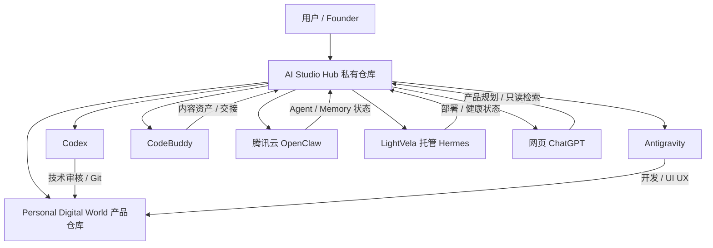

# Personal Digital World AI Studio｜本地＋云端共享工作区建设方案

> 状态：Approved / Phase 1 Implemented
> 日期：2026-07-31
> 负责人：用户（最终决策）／Codex（技术架构与实施审核）
> Private Hub：<https://github.com/3201841319lmj-svg/personal-digital-world-ai-studio-hub>

## 1. 目标

建立一个本地与云端共享的 AI Studio Hub，使用户无论与 ChatGPT、Codex、Antigravity、CodeBuddy、OpenClaw 或 Hermes 中的哪一个协作，都能从同一处看到：

- Personal Digital World 的完整项目地图和仓库位置
- 每个 Agent 的职责、工作区、Memory 边界和当前任务
- 最近发生了什么变化、由谁完成、验证到什么状态
- 需要交给下一个 Agent 的上下文、文件、风险和验收标准
- 当前代码、部署与文档的真实来源，而不是依赖口头重复说明

## 2. 架构决策

### 推荐方案：产品仓库＋独立私有 Hub 仓库

保留两个职责不同的 Git 仓库：

1. `personal_-digital_-world`：产品代码与正式项目内容的唯一权威仓库。
2. 已建立私有仓库 `personal-digital-world-ai-studio-hub`：只保存跨 Agent 协作状态、交接、决策、项目清单和自动化脚本。

不要把 Personal Digital World 全量文件再复制进 Hub。复制会产生双重真相、冲突和同步负担。每台本地或云端机器应把两个仓库克隆为相邻目录，由 Hub 的注册表记录产品仓库地址、分支和当前核验提交。

## 3. 逻辑关系



## 4. 各环境建议目录

绝对路径因设备不同而不同，统一的是相对目录结构。

### Windows 本地

```text
C:\Users\黎敏君\AI_Studio_Shared\
├── hub\                         # 独立私有协作仓库
└── repositories\
    └── personal-digital-world\  # 产品仓库完整 clone
```

### 腾讯云 Linux（建议，最终路径由 Hermes 确认）

```text
/srv/pdw-ai-studio/
├── hub/                         # 协作仓库 clone
└── repositories/
    └── personal-digital-world/  # 产品仓库 clone
```

不要把 Windows 绝对路径写成云端必须使用的路径。Hub 只保存逻辑名称和相对路径；每个环境的真实挂载记录放在不含凭据的本地配置中。

## 5. Hub 仓库建议结构

```text
personal-digital-world-ai-studio-hub/
├── README.md
├── AGENTS.md
├── CURRENT_STATE.md
├── PROJECT_REGISTRY.yaml
├── WORKSPACE_REGISTRY.yaml
├── CHANGELOG.md
├── decisions/
│   └── README.md
├── handoffs/
│   ├── inbox/
│   ├── active/
│   └── completed/
├── agents/
│   ├── chatgpt/
│   ├── codex/
│   ├── antigravity/
│   ├── codebuddy/
│   ├── openclaw/
│   └── hermes/
├── status/
│   ├── projects/
│   ├── deployments/
│   └── agents/
├── schemas/
│   ├── handoff.schema.json
│   ├── project.schema.json
│   └── workspace.schema.json
├── scripts/
│   ├── bootstrap.ps1
│   ├── bootstrap.sh
│   ├── refresh-status.ps1
│   └── refresh-status.sh
└── .gitignore
```

## 6. 文件职责

| 文件 / 目录 | 职责 | 谁可修改 |
|---|---|---|
| `README.md` | Hub 入口、读取顺序和使用说明 | Codex 审核 |
| `AGENTS.md` | Hub 内所有 Agent 的强制协作规则 | 用户批准、Codex 维护 |
| `CURRENT_STATE.md` | 当前项目、任务、阻塞和最近变更的简明快照 | 脚本生成或 Codex 审核 |
| `PROJECT_REGISTRY.yaml` | 所有项目、仓库、路径、状态和负责人 | Codex 审核 |
| `WORKSPACE_REGISTRY.yaml` | 各环境的逻辑工作区与非敏感路径映射 | 各 Agent 提交、Codex 审核 |
| `CHANGELOG.md` | Hub 自身的重要结构变更 | 修改者追加 |
| `decisions/` | 用户批准的架构与产品决策 | ChatGPT/Codex 起草，用户批准 |
| `handoffs/` | 跨 Agent 任务交接 | 每个 Agent 只写自己的交接文件 |
| `agents/<name>/` | 每个 Agent 的公开状态、能力和非敏感 Memory 摘要 | 对应 Agent 自治 |
| `status/deployments/` | 部署版本、健康状态和回滚信息 | Hermes 提交，Codex 审核 |

## 7. 同步原则

### 每个 Agent 开始任务前

1. 拉取 Hub：`git pull --ff-only`。
2. 阅读 `AGENTS.md`、`CURRENT_STATE.md` 和自己的 `agents/<name>/README.md`。
3. 根据 `PROJECT_REGISTRY.yaml` 找到正确产品仓库和模块。
4. 拉取产品仓库并核验分支、Git 状态和当前提交。
5. 创建自己的任务分支，禁止直接覆盖其他 Agent 工作。

### 每个 Agent 完成任务后

1. 在产品仓库提交实际代码或文档变更。
2. 在 Hub 创建一份结构化 handoff，写明提交、文件、测试、风险和下一责任人。
3. 更新自己负责的公开状态文件；不改其他 Agent 的自治 Memory。
4. 由 Codex 审核产品变更和 Hub 状态，再进入发布或用户验收。

## 8. 权限模型

### 默认最小权限

| 身份 | 产品仓库 | Hub 仓库 | 生产服务器 |
|---|---|---|---|
| 用户 | 管理员 | 管理员 | 最终授权 |
| Codex | 分支、PR、审核与合并 | 维护者 | 只读诊断；部署需授权 |
| Antigravity | 开发分支与 PR | 写自己的状态 / handoff | 无默认权限 |
| CodeBuddy | 不直接 push 产品代码 | 写内容状态 / handoff | 无权限 |
| OpenClaw | 默认只读；需要时写专属分支 | 写 `agents/openclaw` 与自己的 handoff | 仅其运行所需目录 |
| Hermes | 默认只读代码 | 写部署状态与 handoff | 运维权限，危险操作需审批 |
| ChatGPT | 通过 GitHub App 只读 | 通过 GitHub App 只读 | 无直接权限 |

### GitHub 保护

- 两个仓库都建议设为 Private。
- `main` 启用分支保护，禁止 Agent 直接 push。
- 使用 `CODEOWNERS` 要求核心治理文件由用户或 Codex 审核。
- OpenClaw 与 Hermes 使用不同的 deploy key / GitHub App 凭据，便于单独撤销。
- Token、SSH 私钥、服务器密码、证书正文和模型 API Key 永不进入 Git。

## 9. 网页 ChatGPT 的接入方式

网页 ChatGPT 不能直接读取用户 Windows 电脑上的任意本地文件。OpenAI 官方说明，Web 与移动端 Work 不能直接访问电脑本地文件；桌面端需要用户明确打开并授权本地文件夹。[ChatGPT Work and Codex](https://help.openai.com/en/articles/20001275-chatgpt-work-and-codex)

### 推荐：GitHub App 只读接入

在 ChatGPT 的 Settings → Apps 中连接 GitHub，并只授权以下私有仓库：

- `personal_-digital_-world`
- `personal-digital-world-ai-studio-hub`

GitHub App 可让 ChatGPT 读取仓库代码、README 和文档；官方同时说明该 ChatGPT GitHub App 是只读的，不能通过它直接 push 或创建代码更新。[Connecting GitHub to ChatGPT](https://help.openai.com/en/articles/11145903/)

### 后续可选：腾讯云自建 MCP App

若未来确实希望网页 ChatGPT 对 Hub 执行受控写入，可在腾讯云部署一个最小权限 MCP 服务，只暴露以下工具：

- `read_current_state`
- `search_projects`
- `create_handoff_draft`
- `submit_agent_status`

ChatGPT 支持通过自建 App（MCP）连接内部数据和获批工具；是否可用取决于账户方案与工作区设置。[Apps in ChatGPT](https://help.openai.com/en/articles/11487775-connectors-in)

不要让 MCP 暴露任意 shell、任意文件路径或生产服务器 root 权限。

### 临时备选：文件上传

可以把同步笔记上传到 ChatGPT Library 或对话，但这是快照，不会自动跟随 Git 更新，不适合作为长期唯一同步机制。[File storage and Library in ChatGPT](https://help.openai.com/en/articles/20001052/library)

## 10. OpenClaw 与 Hermes 接入

### OpenClaw

- 在腾讯云克隆 Hub 和产品仓库。
- 默认只读产品仓库。
- 只写 `agents/openclaw/`、自己的 handoff 和明确授权的 Agent 配置分支。
- OpenClaw 私有 Memory 不同步原文到 Hub，只发布非敏感摘要、版本和引用位置。

### Hermes

- 通过 LightVela 管理的服务器会话读取两个仓库。
- 只在 `status/deployments/` 记录版本、环境、健康检查、日志引用和回滚结果。
- 不把服务器地址、账号、Token、证书或日志中的敏感信息提交到 Hub。
- 部署从明确的 commit SHA 或 release tag 执行，禁止从“某 Agent 说已经完成”直接部署。

## 11. 变化通知机制

Hub 不应依赖所有 Agent 不断轮询一份超长文档。建议使用三种层级：

1. `CURRENT_STATE.md`：面向人和 Agent 的短摘要。
2. `handoffs/`：每项任务的结构化交接和证据。
3. Git history / PR：完整审计轨迹。

后续可以增加：

- GitHub Actions 在合并后重新生成 `CURRENT_STATE.md`。
- 腾讯云定时任务每 5–15 分钟执行 `git pull --ff-only`。
- OpenClaw / Hermes 在发现新 handoff 时发送通知，但不自动执行高风险操作。
- Gitee 作为国内镜像，优先用于国内服务器拉取；Hub 是否镜像到 Gitee需由用户决定。

## 12. 分阶段实施

### Phase 0：仓库核心文档（本次）

- 根目录 `AGENTS.md`
- 根目录 `AI_TEAM_SYNC_NOTEBOOK.md`
- 根目录 `AI_STUDIO_SHARED_WORKSPACE_PLAN.md`
- README 快速入口

### Phase 1：建立私有 Hub

- ✅ 用户已确认仓库名与 Private 可见性。
- ✅ Codex 已创建并发布 Hub 基础目录、Schemas、模板和 bootstrap 脚本。
- ✅ 本机已建立 `C:\Users\黎敏君\AI_Studio_Shared`，并并列克隆两个仓库。
- 当前 Hub 提交：`9aed518f796464ec09e5f57d70129b899fdc7fd8`。

### Phase 2：本地 Agent 接入

- Antigravity、CodeBuddy、Codex 从 Hub 读取统一状态。
- 每个 Agent 只写自己的状态和 handoff。
- 验证一次完整需求 → 开发 → 内容 → 审核交接闭环。

### Phase 3：云端 Agent 接入

- 腾讯云部署 Hub 与产品仓库的只读 / 最小写权限 clone。
- OpenClaw 与 Hermes 使用独立凭据。
- 配置定时拉取、状态更新和失败告警。

### Phase 4：网页 ChatGPT 接入

- 首选连接 GitHub App 读取两个私有仓库。
- 若需要受控写入，再评估自建 MCP App。

## 13. 已确认的五项架构决定

| 决定 | 推荐默认值 |
|---|---|
| Hub 是否独立仓库 | 是，避免把高频协作日志混入产品代码 |
| Hub 仓库名 | `personal-digital-world-ai-studio-hub` |
| 可见性 | Private |
| 本地根目录 | `C:\Users\黎敏君\AI_Studio_Shared` |
| 云端根目录 | `/srv/pdw-ai-studio`，由 Hermes 最终确认 |

## 14. 验收标准

当以下条件全部满足，才可以说“所有 Agent 已共享同一个工作区”：

1. 本地与腾讯云都能拉取 Hub 和产品仓库。
2. 每个 Agent 能读取自己的职责、项目注册表和当前状态。
3. 每个 Agent 只能在获准路径和分支写入。
4. 一次真实任务可从 ChatGPT 产品规划走到 Codex 审核，并留下完整 handoff。
5. 网页 ChatGPT 能通过 GitHub App读取两个仓库；若需要写入，必须走受控 MCP 或交给 Codex。
6. 任意凭据泄露时可以单独撤销对应 Agent 的权限，而不影响其他 Agent。
7. 所有同步失败都有可观察日志，且不会静默覆盖产品代码。
